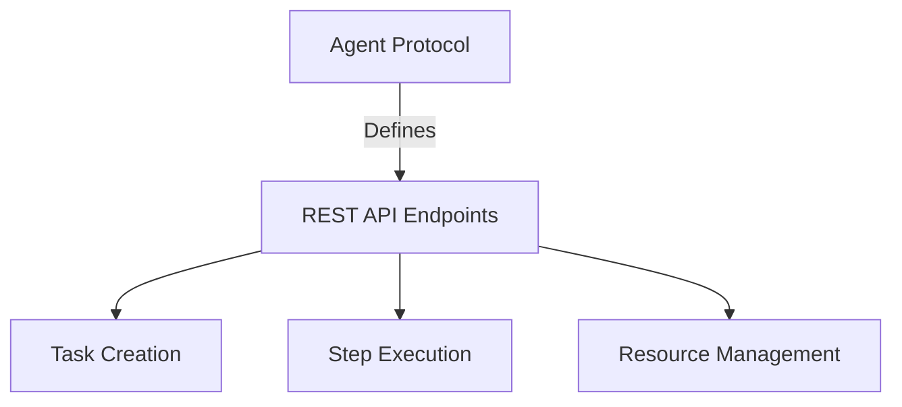

<h1 align="center">
  <br>
  
  <br>
  🤖 Agent Protocol
  <br>
</h1>

<p align="center">
  <em>A Universal Communication Interface for AI Agents</em>
</p>

<p align="center">
  <a href="https://discord.gg/bJnNh666C3">
    
  </a>
  <a href="https://twitter.com/e2b_dev">
    
  </a>
  
  
</p>

<p align="center">
  <a href="#-docs">Documentation</a> •
  <a href="#-summary">Summary</a> •
  <a href="#-features">Features</a> •
  <a href="#-adoption">Adoption</a> •
  <a href="#-components">Components</a>
</p>

<div align="center">

```text
🌟 Star us on GitHub — it helps! 🌟
```

</div>

---

## 📚 Documentation

<div align="center">

**[Check out our comprehensive documentation here](https://agentprotocol.ai/)**

</div>

## 🧾 Summary

<p align="center">
  
</p>

The AI agent ecosystem is evolving rapidly, but faces a critical challenge: **fragmentation**. Each developer builds agents differently, making it difficult to:

- 🔄 Communicate between different agents
- 📊 Compare agent performance
- 🛠️ Develop universal tools

Enter the **Agent Protocol** - your solution to standardized agent communication!

## ✨ Features

<div align="center">

|  Feature | Description |
|:--------:|-------------|
| 🌐 **Universal** | Works with any tech stack |
| 🔌 **Plug & Play** | Simple integration process |
| 🚀 **Scalable** | Built for growth |
| 📈 **Benchmarkable** | Easy performance testing |

</div>

## 💪 Why Adopt the Protocol?

<p align="center">
  
</p>

- 🎯 **Easy Benchmarking** - Compare your agent's performance
- 🤝 **Enhanced Integration** - Simple to use with other systems
- 🛠️ **Development Tools** - Access to universal dev tools
- ⚡ **Focus on Innovation** - Less boilerplate, more creation

## 🗺️ Components

### 📋 Protocol


### 🎁 SDK & Client

<div align="center">

| Component | Purpose |
|:---------:|---------|
| 📦 **SDK** | Build agents easily |
| 🔌 **Client** | Interact with agents |

</div>

## 🌟 Adoption

### Current Adopters

<p align="center">
  
</p>

✅ **Live**
- [Auto-GPT](https://github.com/Significant-Gravitas/Auto-GPT)
- [Auto-GPT-Forge](https://github.com/Significant-Gravitas/Auto-GPT-Forge)
- [smol developer](https://github.com/smol-ai/developer)

🚧 **In Progress**
- [babyagi](https://github.com/yoheinakajima/babyagi)
- [beebot](https://github.com/AutoPackAI/beebot)

## 🔮 Future Roadmap

<div align="center">

| Phase | Focus Area |
|:-----:|------------|
| 1️⃣ | Agent-to-Agent Communication |
| 2️⃣ | External Service Integration |
| 3️⃣ | User Authentication |
| 4️⃣ | Protocol Plugins |

</div>

## 🤝 Join Our Community

<div align="center">

[](https://discord.gg/TxDzUWab)
[](https://discord.gg/autogpt)
[](https://discord.gg/U7KEcGErtQ)

</div>

---

<div align="center">

### 💫 Made with ❤️ by the AI Community

**[Start Contributing Today!](#-docs)** 

</div>
